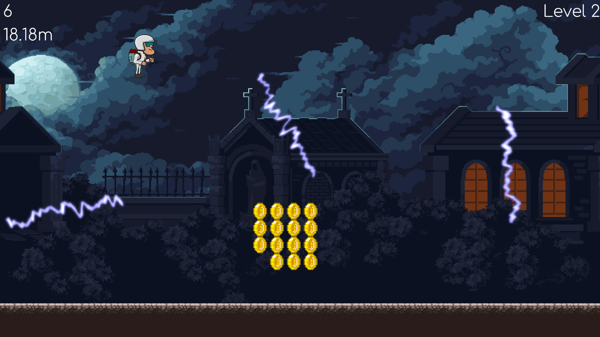

# Jetpack joyride

 

## Controls

- Spacebar to use the jetpack
- Enter key to start the game

## Gameplay

- 3 levels
- Use the jetpack to avoid zappers and collect coins
- Score is based on distance travelled and coins collected

## Features

- 3 levels
- Character moves up on press of spacebar
- Gravity affects character speed
- Character runs on the ground
- Random zappers are spawned with attributes depending on the level
- Some zappers rotate, while some just move up and down
- Player can collect coins
- UI screen before each level
- HUD which includes text for distance travelled, coins collected and the current level
- Win or lose UI screen
- Bloom effect on player jetpack fire and around zappers.
- A separate framebuffer is used for bloom, so we can have bloom of any color

## Compiling and running

```bash
# in project root
cmake -S . -B build
make -C build
./build/app
```

**Note:** FreeType is required for rendering text.

## Screenshots

 
 
 
