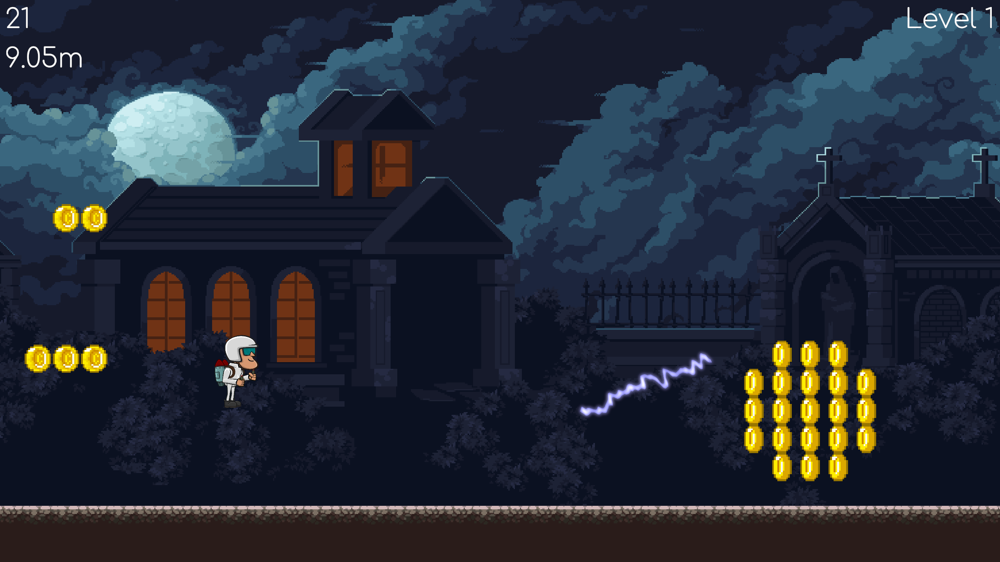
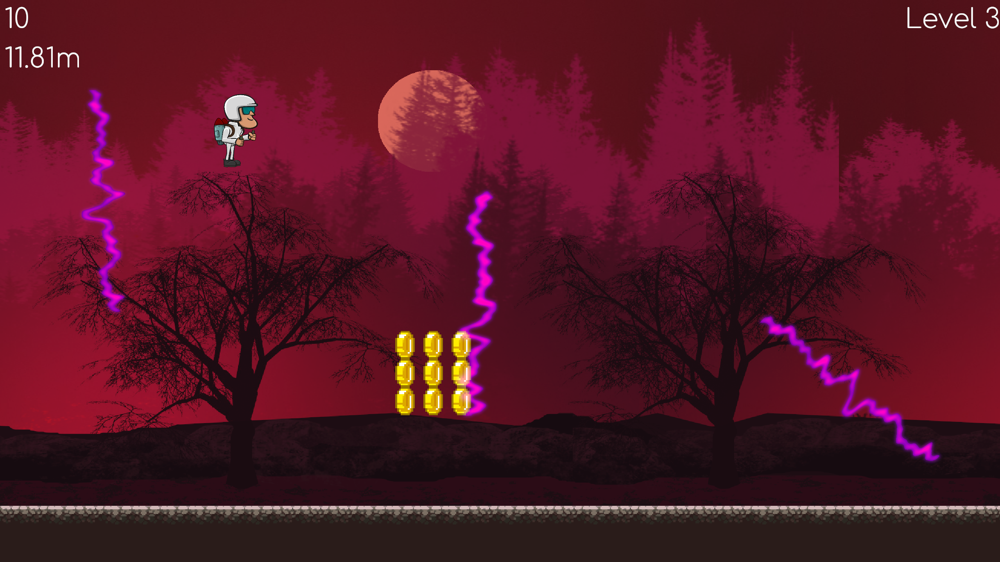
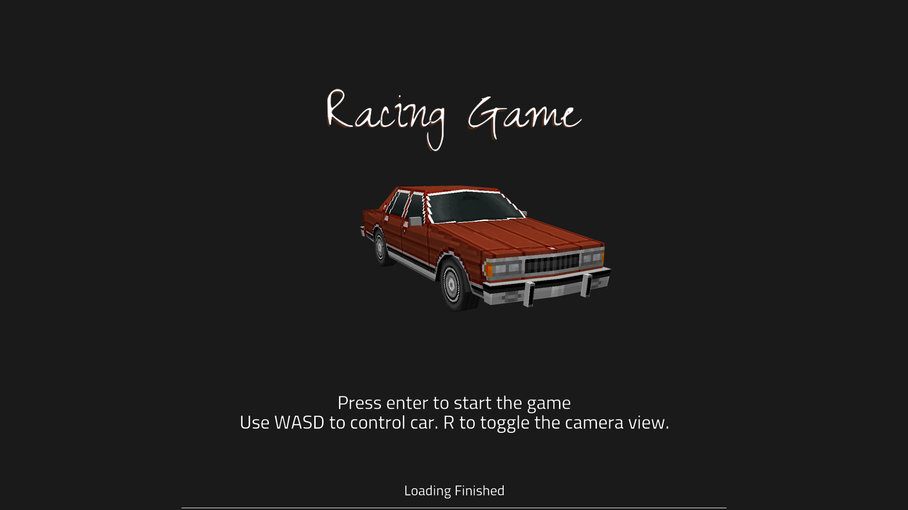
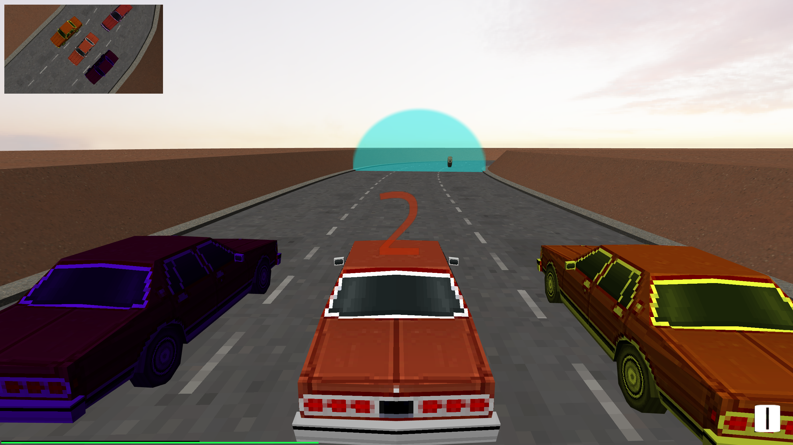
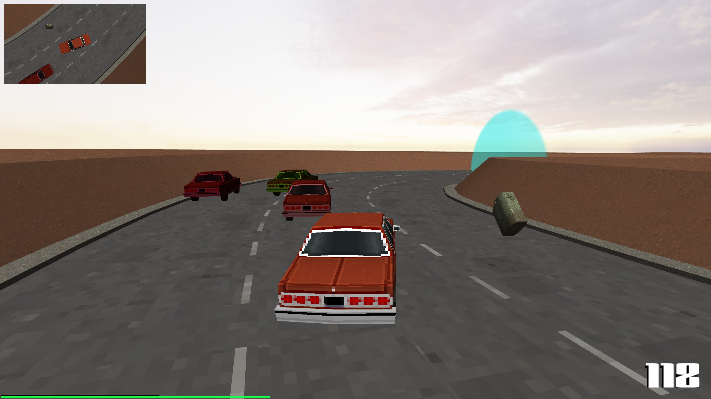

# Starter Code

**NOTE: Only works on linux. Tested only on fedora.**

## Compiling and running

```bash
# in project root
cmake -S . -B build
make -C build
./build/app
```

**Note:** FreeType is required for rendering text.

## Screenshots

 
 

 
 
 
